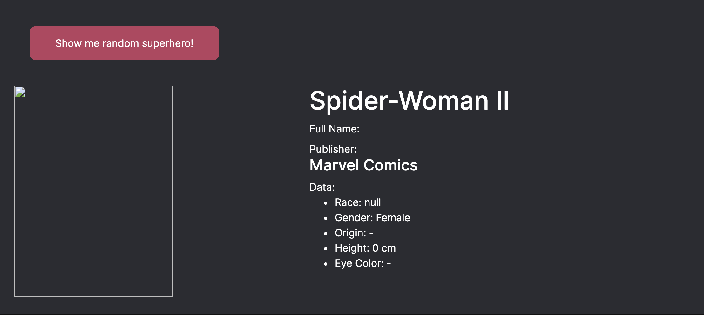

# Marvel vs DC

PC vs Apple, Bad vs Evil there are multiple of ongoing rivalries in our culture.
The main one in the comic book community is Marvel vs DC. This project focuses on comparing both of them as well as provide a broader look at their combined landscape.

[Visit live project](https://delegacz.github.io/md-milestone-project-2/)

## UX

### Wireframes: 
[Figma Link](https://www.figma.com/proto/YIxpkiMtXfE8miEKQM9v4YaQ/Untitled?node-id=1%3A2&viewport=391%2C305%2C0.1969379186630249&scaling=min-zoom&redirected=1)

This website is a one-page dashboard consisting of a sidebar on the left-hand side (to provide controls and filters ) and content area on the right containing various graphs displaying the data.

### Goal

The main focus of the user experience of this project was the simplicity and ease of interaction. It was achieved through sensible color palette, elegant and simple layout and convenience features such as a collapsing sidebar, sticking always visible sidebar controls and back to top button.

#### Who is this website for?

This website is for people interested in comic books that want to look at their long history through the lens of data and numbers.

#### What does it fulfil?

This website displays and allows users to interact with data through various graphs. Data consists of a list of comic book characters with various properties. It also features a generator of a random superhero by using Superhero API.

#### What it is that users want to achieve

Users want to look up and compare data. Data is visualized through interactive graphs.

#### User Stories

- As a user, I can filter data by gender so I can see a percentage of woman characters across the dataset.
- As a user, I can filter data by alignment so I can see a percentage of bad characters that first appeared in 1959.
- As a user, I can filter data by race so I can see an alignment distribution across a race of Gods.
- As a user, I can filter data by Universum so I can see a peak of the first appearances in Marvel Universum.

## Design 

The overall design is very simplistic: Sidebar on the left content divided into sections to the right.
Additionally, all elements are separated from each other by the use of colors. Each section displaying data has its own background, as well as Navigation elements. All Interactive elements like graphs and buttons use separate color pallet for clear indication fo interactivity.

### Color Pallet

The Goal for color was readability and ease of distinguishing elements in graphs.

#### UI Elements Colors:

UI Elements are mostly represented by a range of blacks and greys which helps to contrast them from interactive elements like buttons and graphs.

    

#### Data Elements Colors:

Data elements, as well as interactive parts of the projects (buttons), are represented by a range of vibrant and hierarchal colors.

    

#### Gender Colors:

Some may ask why gender colors are so different from the main pallet. My reasoning behind that change was that 'blue' and 'pink' contrast is very culturally clear we associate blue with males and pink with females. There might be some exceptions I think most users will be able to make that connection. Because of that change, there is no need for a legend when using scatterplot which reduces visual clutter

    

#### Typography 

The website uses Inter across all type elements. 

## Features
 
### Existing Features

- Superhero randomizer - Allows User to display a random superhero from Superhero API `static/js/superHeroAPI.js`
- Universum Selector - Allows users to pick Universum (Marvel or DC) to filter
displayed data
- Race Selector - Allows users to filter data by all races from the dataset
- Alignment Selector Allows users to filter data display by the alignment of character (good, bad, neutral)
- Reset All button - Allows users to reset all filters and go to the default state of the information displayed
- Back to top button - Allows users to move to the top of the page without the need of scrolling manually
- Collapsing Sidebar - Allows users to review graphs and data 'on fullscreen' it also allows mobile users to save screen space when interacting with the application

### Features Left to Implement

- Character vs Character based on their Power statistics.

## Technologies Used

- [D3.js](https://d3js.org/)
    - The project uses **D3.js** to provide backbone to data visualization.

- [dc.js](https://dc-js.github.io/dc.js/)
    - The project uses **dc.js** to simplify data visualization by leveraging d3.js

- [crossfilter](https://square.github.io/crossfilter/)
    - The project uses **crossfilter** 
- [JQuery](https://jquery.com)
    - The project uses **JQuery** to simplify DOM manipulation and improve users experiance.
- [queue.js](https://jquery.com)

- [Superhero API](https://www.superheroapi.com/)
    - The project uses **Superhero API** for random hero generation
- [Cors.io](https://cors.io/) 
    - An CORS Proxy for purposes of dealing with  'Access-Control-Allow-Origin' header error

## Testing

1. The website was tested on the following browsers: Chrome, Safari, Firefox, Opera. Please note that the test was performed on the latest version of each browser. Testing has shown only one issue: In Safari where Sidebar collapse button is not sticking even though `-webkit-sticky` was used. After the research issue is still present and may be resolved in the future.

2. HTML Code was put through [W3 Validator](https://validator.w3.org) which reported no issues or warnings,

3. All JavaScript code was put through [semantic validator](http://esprima.org) with no issues found.

4. The website was tested on mobile devices (iPhone X and iPhone XR) and was reported working as expected. Please note that this project is NOT MOBILE Responsive but all care was put into making it functional on smaller screen sizes. For graphs that are too big to fit given display CSS property overflow: auto; was used for horizontal scrolling option.

### User Stories Testing

The number of the manual test were performed following user stories highlighted in UX Section of this document.

### Manual Testing

#### Sidebar

1. Inside sidebar elements, as well as collapse button, are sticking when scrolling
2. Collapse function is working properly
3. Universum Selector is filtering data correctly
4. Race Selector is filtering data correctly
5. Alignment Selector is filtering data correctly
6. Combination of Selectors Values works as expected, applying all filters to graphs
7. Rest button properly resets all filters and redraws all graphs to default values

- All following tests were confirmed on mobile resolutions through Google Dev Tools

#### Graphs

1. All Graphs display tooltips where appropriate.
2. All Graphs and Charts react to filters and interaction 
3. All Graphs and Charts use `overflow: auto` for mobile horizontal scrolling and this is functioning properly

#### API Behaviour 

1. API Loader is displayed when JavaScript function is engaged
2. All the information IF AVAILABLE is displayed and formatted properly in render area
    - Please note that Superhero API has some bugs of its own. You can read more about problems the user may encounter when using Random Super Hero Generator in [Bug section](#bugs)
3. Error Messages for STATUS 404 and 503 are working as expected and render as a message in h1 tags

## Bugs 

Following the test conducted in the previous section of this document I have encountered the following issues:

### API

1. To best of my knowledge and research, there is no obvious way to allow `Access-Control-Allow-Origin` on Github Pages due to this I had to use [CORS Proxy](https://cors.io/). Unfortunately, this service appears to be unavailable on some occasions which result in API responding with code 503. In order to give user context error message was provided.
2. Resources (mainly images) are missing from some records in API dataset. This may result in some information not being rendered to the user.

Example Screenshot:
 

### iOS and Safari

Even though `-webkit-` prefix is used in CSS `position: sticky` attribute, Sidebar collapse button does not seem to be sticky on both Safari as well as the iOS version of Safari and Google Chrome.

## Deployment

This project was developed using [Microsoft Visual Studio Code](https://code.visualstudio.com/). [Git](https://git-scm.com/) was used for version control and backup, It was then pushed to remote [repository on github](https://github.com/delegacz/md-milestone-project-2). GitHub repository was then pushed to GitHub Pages Accessible [here](https://delegacz.github.io/md-milestone-project-2/)

##### Deployment Process

1. Login to [GitHub](https://www.github.com/)
2. Select **delegacz/md-milestone-project-2** from depository list
3. Go to **Settings** from the navigation on the top of the page
4. Scroll down to Github Pages section, then click **Source** and change it to **master branch**
5. The page is refreshed and deployed. It may take a couple of minutes to be available 

The website was coded in Visual Studio Code. Version Control and backup were managed using git. The project was committed and pushed to remote GitHub repository and made accessible using Git Hub Pages.

## Credits

- [Inter Font](https://rsms.me/inter/) by [Rasmus Andersson](https://rsms.me/about/)
- [SuperheroAPI](https://www.superheroapi.com/)
- [dc.js documentation](https://dc-js.github.io/dc.js/docs/html/index.html) 

### Content

- Core data set [Source](https://www.kaggle.com/thec03u5/complete-superhero-dataset) was edited and optimised by me for purposes of this project [Edited version](https://docs.google.com/spreadsheets/d/1UUGye5Q6DPn7NuKc09viH5Moh8dNLq6PCgp1NilCPx8/edit?usp=sharing)
- [Collapsing Sidebar for Bootstrap](https://bootstrapious.com/p/bootstrap-sidebar)

### Media

- [SuperheroAPI](https://www.superheroapi.com/)  - API Used for random hero generator

- All pictures visible are sourced from Superhero API and are under copyright from their respectful publishers 

### Acknowledgements

- [Rasmus Andersson](https://rsms.me/about/) - Amazing Inter Font
- [DC Comics](https://www.dccomics.com/) - Inspiration and great characters 
- [Marvel Comics](www.marvel.com) - Inspiration and great characters 

### Help with coding
 - [dc.js documentation](https://dc-js.github.io/dc.js/docs/html/index.html)